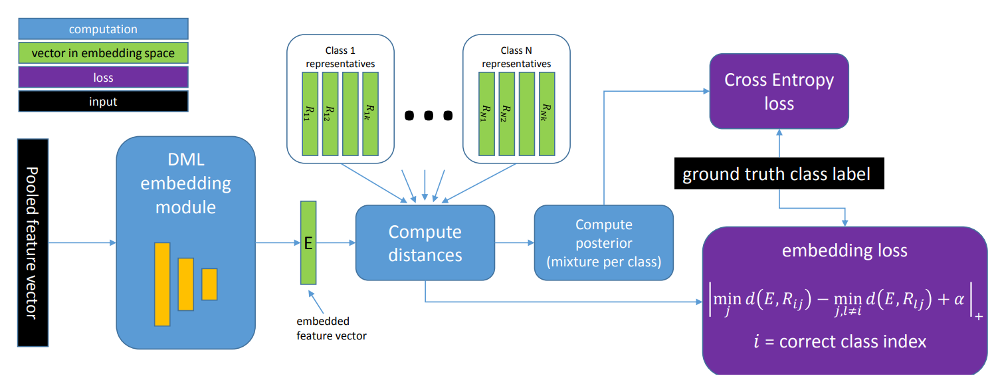

# Magnet Loss and RepMet in PyTorch

This takes a lot from the Tensorflow Magnet Loss code: [pumpikano/tf-magnet-loss](https://github.com/pumpikano/tf-magnet-loss)

### Magnet Loss

"[Metric Learning with Adaptive Density Discrimination](http://arxiv.org/pdf/1511.05939v2.pdf)" introduced
a new optimization objective for distance metric learning called Magnet Loss that, unlike related losses,
operates on entire neighborhoods in the representation space and adaptively defines the similarity that is
being optimized to account for the changing representations of the training data.

### RepMet

"[RepMet: Representative-based Metric Learning for Classification and One-shot Object Detection](https://arxiv.org/pdf/1806.04728.pdf)"
extends upon magnet loss by storing the centroid as representations that are learnable, rather than just
 statically calculated every now and again with k-means.

## Implementation

Tested with python 3.6 + pytorch 0.4 + cuda 9.1

See `train.py` for training the model, please ensure your `path` is set in `configs.py`.

Currently works on MNIST, working on getting the implementation to work with [Oxford Flowers 102](http://www.robots.ox.ac.uk/~vgg/data/flowers/102/) and [Stanford Dogs](http://vision.stanford.edu/aditya86/ImageNetDogs/) at the moment.
